<!-- ======================================================= -->
<!--                   TERMINAL BANNER                     -->
<!-- ======================================================= -->
<div align="center">
  <picture>
    <source media="(prefers-color-scheme: dark)" srcset="output/dark.svg">
    <source media="(prefers-color-scheme: light)" srcset="output/light.svg">
    
  </picture>
</div>

<br>

<!-- ======================================================= -->
<!--                   INTRODUCTION                        -->
<!-- ======================================================= -->
<div align="center">
  <h3><code>&gt; whoami</code></h3>
  <p>
    <strong>Aditya</strong> &nbsp;|&nbsp; <code>@AAditya-debug</code><br>
    <strong>Python Developer &amp; AI/ML Enthusiast</strong><br>
    📍 <em>Jaipur, India</em> &nbsp;•&nbsp; 🎓 <em>BCA</em><br>
    <code>Learning • Building • Shipping</code>
  </p>
</div>

---

### 📌 About Me

```bash
$ cat about.json
{
  "name": "Aditya",
  "role": "Python Developer / AI-ML Developer",
  "education": "Bachelor of Computer Applications (BCA)",
  "location": "Jaipur, India",
  "current_focus": [
    "Python Backend Development",
    "AI / Machine Learning Fundamentals",
    "Data Structures & Algorithms (DSA)",
    "Database Engineering (SQL & NoSQL)"
  ],
  "philosophy": "Writing clean, practical, and efficient code."
}
```

---

### 🛠️ Tech Stack &amp; Tools

*Currently working with and exploring:*

#### **Languages**
<p>
  
  
  
</p>

#### **Frontend**
<p>
  
  
  
</p>

#### **Databases**
<p>
  
  
</p>

#### **Developer Tools &amp; Platforms**
<p>
  
  
  
  
  
</p>

---

### 📊 Self-Hosted GitHub Statistics

<!-- Dynamic self-hosted statistics card powered by serverless GraphQL API -->
<div align="center">
  <picture>
    <source media="(prefers-color-scheme: dark)" srcset="https://git-hub-profile-ashy.vercel.app/api/stats?theme=dark">
    <source media="(prefers-color-scheme: light)" srcset="https://git-hub-profile-ashy.vercel.app/api/stats?theme=light">
    
  </picture>
</div>

---

### 🐍 Contribution Activity

<div align="center">
  <picture>
    <source media="(prefers-color-scheme: dark)" srcset="https://raw.githubusercontent.com/AAditya-debug/AAditya-debug/output/github-contribution-grid-snake-dark.svg">
    <source media="(prefers-color-scheme: light)" srcset="https://raw.githubusercontent.com/AAditya-debug/AAditya-debug/output/github-contribution-grid-snake.svg">
    
  </picture>
</div>

---

### 🚀 Projects

| Project | Description | Status |
| :--- | :--- | :---: |
| **[BookVault](https://github.com/AAditya-debug/BookVault)** | Digital library and reading management repository | `Public Repository` |
| **TaskForge** | Productivity and developer task management tool | `Planned` |
| **StudentDesk** | Academic workflow and study resource organizer | `Planned` |
| **SpendWise** | Personal budget analytics and expense tracking application | `Planned` |
| **StudyTrack** | Revision scheduler and syllabus progress tracker | `Planned` |

---

### 🎯 Current Focus &amp; Goals

- 💻 **Backend Architecture:** Deepening Python server architecture, APIs, and clean modular code.
- 🤖 **AI &amp; Machine Learning:** Building intuition with practical ML algorithms and data workflows.
- 🗄️ **Databases &amp; Systems:** Designing robust relational schemas and optimizing query performance.
- 📦 **Open Source:** Actively building and deploying real-world software solutions.

---

### 📫 Connect

- **GitHub:** [@AAditya-debug](https://github.com/AAditya-debug)
- *Additional links (LinkedIn, portfolio, email) will be added as they are made public.*
